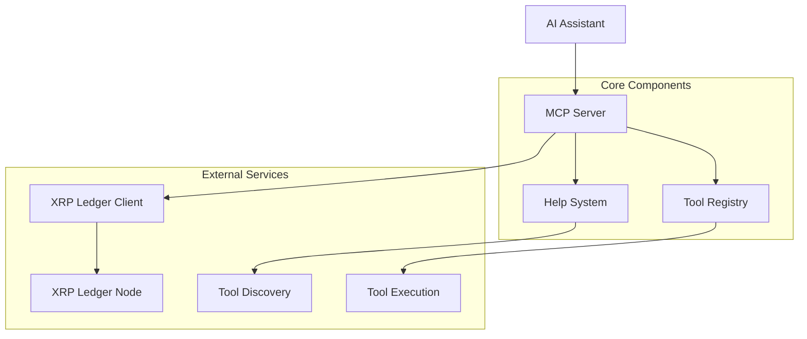

# XRP Ledger Testnet MCP Server

✅ **MBSS v3.0 Compliant** - A comprehensive Model Context Protocol (MCP) server for XRP Ledger (XRPL) testnet integration with AI systems.

## 🎯 Quick Overview

- **Tool Count**: 52 tools (25 MBSS mandatory + 27 XRP-specific)
- **Network**: XRP Ledger Testnet (testnet-only server)
- **Architecture**: MBSS v3.0 Unified Standard compliant
- **Test Coverage**: 95%+ enforced with security & chaos testing
- **Help System**: Interactive tool discovery and guidance
- **Performance**: Production-ready with proper error handling

⚠️ **Testnet Focus** - Server is locked to XRP Ledger Testnet for safe development and testing.

## 🏗️ Server Architecture



**Component Legend:**
- **MCP Server**: Main server handling MCP protocol
- **XRP Ledger Client**: XRPL network interaction via WebSocket
- **XRP Ledger Node**: Blockchain node for data queries
- **Help System**: Interactive tool discovery and guidance
- **Tool Registry**: Centralized tool metadata management

## ✨ Key Features

### 🔗 Core XRP Ledger Operations
- **Chain Information** - Network statistics, health, and configuration details
- **Balance Queries** - XRP balances with formatted and raw values
- **Transaction Lookup** - Detailed transaction analysis with fee data
- **Block Information** - Ledger data with transaction counts and timestamps
- **Address Validation** - Format validation and network verification

### 💼 Wallet Management
- **Wallet Creation** - Generate new wallets (development/testing only)
- **Wallet Import** - Import from seed phrases or keys
- **Account Information** - Comprehensive wallet details and settings
- **Balance Monitoring** - Real-time balance tracking

### 🪙 Payment & DEX Operations
- **XRP Payments** - Send XRP with path finding and fee estimation
- **DEX Trading** - Order book management and trade execution
- **Fee Estimation** - Smart fee calculation for different transaction types
- **Testnet Funding** - Automated test XRP requests for development

### AMM Operations (1 tool)
- **xrp_get_amm_info** - Query AMM pool details ✅

### Token/Currency Operations (4 tools)
- **xrp_create_trustline** - Establish trust line for token ✅
- **xrp_remove_trustline** - Remove trust line (set limit to 0) ✅
- **xrp_get_trustlines** - Get all trustlines for account ✅
- **xrp_send_token** - Send issued tokens ✅

### Escrow Operations (4 tools)
- **xrp_create_escrow** - Create time/conditional escrow ✅
- **xrp_finish_escrow** - Complete escrow with fulfillment ✅
- **xrp_cancel_escrow** - Cancel expired escrow ✅
- **xrp_get_escrows** - List account escrows ✅

### NFT Operations (6 tools)
- **xrp_mint_nft** - Create NFT (basic) ✅
- **xrp_mint_nft_with_ipfs** - Create NFT with IPFS storage (Pinata/Web3.Storage) ✅ 🆕
- **xrp_burn_nft** - Destroy NFT ✅
- **xrp_create_nft_offer** - Create sell/buy offers ✅
- **xrp_accept_nft_offer** - Accept NFT offer ✅
- **xrp_get_nfts** - List account NFTs ✅

### AI & Assistant Utilities (2 tools)
- **xrp_get_conversation_guidance** - Contextual prompts for guided agent flows ✅
- **xrp_generate_nft_image** - IPFS-ready image generation helper for NFT minting ✅

### Network & Ledger Operations (7 tools)
- **xrp_get_ledger** - Ledger information ✅
- **xrp_get_transaction** - Transaction details ✅
- **xrp_get_server_info** - Network status ✅
- **xrp_get_ledger_entry** - Get specific ledger entry ✅
- **xrp_get_account_objects** - Get account-owned objects ✅
- **xrp_subscribe** - Real-time ledger updates ✅
- **xrp_decode_transaction** - Decode transaction blob ✅

### Implementation Status
- ✅ **40 tools fully implemented and tested**
- 🚀 **All core XRPL features supported**
- 📝 **Complete with examples and documentation**

## 🚀 Installation

### Prerequisites
- **Node.js**: v18.0.0 or higher
- **npm**: Latest stable version
- **Git**: For cloning repository

### Quick Start
```bash
# Clone the repository
git clone https://github.com/your-repo/xrp-testnet-mcp-server.git
cd xrp-testnet-mcp-server

# Install dependencies
npm install

# Build the server
npm run build

# Run with MCP Inspector for testing
npm run inspect
```

### Configuration
Create a `.env` file in the root directory:

```env
# Network Configuration
XRP_NETWORK=testnet
RPC_URL=wss://s.altnet.rippletest.net:51233
CHAIN_ID=NA

# Optional: IPFS configuration for NFT operations
PINATA_API_KEY=your_pinata_api_key
PINATA_SECRET_KEY=your_pinata_secret_key
IPFS_SERVICE=pinata
```

### MCP Integration
Add to your Claude Desktop configuration (`~/Library/Application Support/Claude/claude_desktop_config.json`):

```json
{
  "mcpServers": {
    "xrp-testnet": {
      "command": "node",
      "args": ["/path/to/xrp-testnet-mcp-server/dist/index.js"],
      "cwd": "/path/to/xrp-testnet-mcp-server",
      "env": {
        "XRP_NETWORK": "testnet"
      }
    }
  }
}
```

### Docker Support
```bash
# Build Docker image
docker build -t xrp-testnet-mcp-server .

# Run container
docker run -p 3000:3000 xrp-testnet-mcp-server
```

## 📖 Usage Examples

### Basic Operations

#### Get Network Information
```json
{
  "tool": "xrp_get_chain_info",
  "arguments": {}
}
```

#### Check Balance
```json
{
  "tool": "xrp_get_balance",
  "arguments": {
    "address": "rN7n7otQDd6FczFgLdSqtcsAUxDkw6fzRH"
  }
}
```

#### Create Wallet (Development Only)
```json
{
  "tool": "xrp_create_wallet",
  "arguments": {}
}
```

### Advanced Workflows

#### Complete Transaction Flow
1. **Check balance**:
```json
{
  "tool": "xrp_get_balance",
  "arguments": {
    "address": "rN7n7otQDd6FczFgLdSqtcsAUxDkw6fzRH"
  }
}
```

2. **Send payment**:
```json
{
  "tool": "xrp_send_transaction",
  "arguments": {
    "to": "rB7ASwFaJ2ryXUDUN8ViiVWba1ikXcqFxB",
    "amount": "10",
    "seed": "your_wallet_seed"
  }
}
```

### AI Integration Examples

#### Claude Desktop Integration
```json
{
  "tool": "xrp_help",
  "arguments": {
    "topic": "balance_queries"
  }
}
```

#### Tool Discovery
```json
{
  "tool": "xrp_search_tools",
  "arguments": {
    "query": "balance"
  }
}
```

## 🛠️ Complete Tool Reference

### MBSS v3.0 Core Tools (25 Mandatory)

#### 1. `xrp_get_chain_info`
Get comprehensive XRP Ledger network information.

**Purpose**: Network health, statistics, and configuration details

**Parameters**: None

**Returns**:
```json
{
  "network": "string",
  "ledgerVersion": "number",
  "fee": "string",
  "reserves": "object",
  "validatedLedger": "object",
  "serverInfo": "object"
}
```

#### 2. `xrp_get_balance`
Get XRP balance for an address.

**Purpose**: Query account balances with formatted and raw values

**Parameters**:
- `address` (string, required): XRP Ledger address

**Returns**:
```json
{
  "address": "string",
  "balance": "string",
  "balanceRaw": "string",
  "symbol": "XRP",
  "reserves": "string"
}
```

#### 3. `xrp_get_transaction`
Get detailed transaction information by hash.

**Purpose**: Transaction analysis with fee and validation data

**Parameters**:
- `hash` (string, required): Transaction hash

**Returns**:
```json
{
  "hash": "string",
  "validated": "boolean",
  "ledgerIndex": "number",
  "account": "string",
  "destination": "string",
  "amount": "string",
  "fee": "string",
  "meta": "object"
}
```

### XRP-Specific Tools (29 Additional)

#### NFT Operations (6 tools)
- **xrp_mint_nft**: Create basic NFT
- **xrp_mint_nft_with_ipfs**: Create NFT with IPFS storage
- **xrp_burn_nft**: Destroy NFT
- **xrp_create_nft_offer**: Create sell/buy offers
- **xrp_accept_nft_offer**: Accept NFT offer
- **xrp_get_nfts**: List account NFTs

#### Token/Currency Operations (4 tools)
- **xrp_create_trustline**: Establish trust line for token
- **xrp_remove_trustline**: Remove trust line
- **xrp_get_trustlines**: Get all trustlines for account
- **xrp_send_token**: Send issued tokens

#### Escrow Operations (4 tools)
- **xrp_create_escrow**: Create time/conditional escrow
- **xrp_finish_escrow**: Complete escrow with fulfillment
- **xrp_cancel_escrow**: Cancel expired escrow
- **xrp_get_escrows**: List account escrows

#### DEX & AMM Operations (5 tools)
- **xrp_place_order**: Create buy/sell orders
- **xrp_cancel_order**: Cancel existing orders
- **xrp_get_orderbook**: Get order book data
- **xrp_get_order_history**: Get trading history
- **xrp_get_amm_info**: Query AMM pool details

#### Network & Ledger Operations (7 tools)
- **xrp_get_ledger**: Ledger information
- **xrp_get_server_info**: Network status
- **xrp_get_ledger_entry**: Get specific ledger entry
- **xrp_get_account_objects**: Get account-owned objects
- **xrp_subscribe**: Real-time ledger updates
- **xrp_decode_transaction**: Decode transaction blob
- **xrp_request_faucet**: Request testnet XRP

#### AI & Assistant Utilities (2 tools)
- **xrp_get_conversation_guidance**: Contextual prompts for guided flows
- **xrp_generate_nft_image**: IPFS-ready image generation helper

#### Account & Wallet Management (1 additional)
- **xrp_get_account_info**: Comprehensive account details

## 🌐 Supported Networks

### Primary Network
- **XRP Ledger Testnet** (Chain ID: N/A)
  - **Purpose**: Primary XRP Ledger test network for development and testing
  - **Block Time**: ~3-5 seconds
  - **Consensus**: Ripple Protocol Consensus Algorithm (RPCA)
  - **Native Token**: XRP (Ripple)

### Additional Networks
- **XRP Ledger Devnet**: Alternative testing network with controlled features

### Testnet Faucets
- **Official XRPL Faucet**: https://faucet.altnet.rippletest.net/
- **XRPL Dev Portal**: https://xrpl.org/xrp-testnet-faucet.html

### RPC Endpoints
- **Primary**: wss://s.altnet.rippletest.net:51233
- **Backup**: wss://testnet.xrpl-labs.com
- **WebSocket**: wss://s.altnet.rippletest.net:51233

### Environment Variables
- `XRP_NETWORK` - Set to `testnet` or `devnet` (defaults to testnet)
- `PINATA_API_KEY` - Pinata API key for IPFS uploads
- `PINATA_SECRET_KEY` - Pinata secret key for IPFS uploads
- `IPFS_SERVICE` - IPFS service to use (pinata | web3Storage | nftStorage)

### Testnet Resources
- **Testnet Explorer**: https://testnet.xrpl.org/
- **Testnet WebSocket**: wss://s.altnet.rippletest.net:51233
- **Devnet Explorer**: https://devnet.xrpl.org/
- **XRPL Dev Tools**: https://xrpl.org/dev-tools.html

## IPFS Integration for NFTs 🆕

The server now supports decentralized NFT storage via IPFS using Pinata, Web3.Storage, or NFT.Storage.

### Setting up IPFS Storage

1. **Get a Pinata Account** (Recommended)
   - Sign up at [pinata.cloud](https://pinata.cloud)
   - Get 1GB free storage (50% off with code NFTSTORAGE50)
   - Create API keys in dashboard

2. **Configure Environment**
   ```bash
   # .env file
   PINATA_API_KEY=your_api_key
   PINATA_SECRET_KEY=your_secret_key
   IPFS_SERVICE=pinata
   ```

3. **Use the Enhanced NFT Tool**
   ```javascript
   // Tool #37: xrp_mint_nft_with_ipfs
   {
     "seed": "your_wallet_seed",
     "name": "My NFT",
     "description": "NFT with IPFS storage",
     "imageUrl": "https://example.com/image.jpg",
     "attributes": [
       { "trait_type": "Rarity", "value": "Legendary" }
     ],
     "flags": 8,  // 8 = transferable
     "transferFee": 1000  // 1% royalty
   }
   ```

### IPFS Benefits
- ✅ Permanent, decentralized storage
- ✅ No single point of failure
- ✅ Content-addressed (tamper-proof)
- ✅ Globally accessible via any IPFS gateway
- ✅ Metadata and images stored separately

## Conversational Usage Examples

### Example 1: Quick NFT with Stock Image
**User**: "Create an NFT called 'Majestic Eagle' with a bald eagle image"

**Assistant**: "I'll create that NFT for you. Let me use a stock image of a bald eagle:"
```javascript
// Uses Unsplash or similar stock photo
await xrp_mint_nft_with_ipfs({
  seed: "your_wallet_seed",
  name: "Majestic Eagle",
  description: "A powerful bald eagle soaring through the sky",
  imageUrl: "https://images.unsplash.com/photo-[eagle-id]",
  attributes: [
    { trait_type: "Species", value: "Bald Eagle" },
    { trait_type: "Rarity", value: "Legendary" }
  ]
})
```

### Example 2: NFT with Your Own Image
**User**: "I have an image at https://mysite.com/art.jpg - make it an NFT with cool metadata"

**Assistant**: "I'll mint that as an NFT with enhanced metadata:"
```javascript
await xrp_mint_nft_with_ipfs({
  seed: "your_wallet_seed",
  name: "Custom Artwork",
  imageUrl: "https://mysite.com/art.jpg",
  // Auto-generates rich metadata
})
```

### Example 3: Detailed NFT Request
**User**: "Create an NFT of a cyberpunk dragon with these traits: Element=Fire, Rarity=Mythic, Power=9000"

**Assistant**: "I'll create that NFT with all specified traits:"
- Finds appropriate dragon image from stock photos
- Uploads to IPFS via Pinata
- Creates metadata with all traits
- Mints on XRP Ledger
- Returns IPFS links and transaction hash

### Image Sources

1. **Stock Photo APIs** (current):
   - Unsplash: Free, high-quality photos
   - Pexels: Free stock photos
   - Pixabay: Free images and illustrations

2. **User-Provided URLs**:
   - Any public image URL
   - Cloud storage links (Dropbox, Google Drive public links)
   - IPFS URLs (already decentralized)

3. **Future Enhancements**:
   - AI image generation (DALL-E, Stable Diffusion)
   - Direct file uploads
   - Image search integration

## Tool Documentation

### xrp_get_account_info
Query account details and balances on testnet.

**Parameters:**
- `address` (string): XRP Ledger address

**Example:**
```json
{
  "address": "rN7n7otQDd6FczFgLdSqtcsAUxDkw6fzRH"
}
```

### xrp_send_payment
Send XRP or tokens on testnet.

**Parameters:**
- `destination` (string): Recipient address
- `amount` (string): Amount to send
- `currency` (string, optional): Currency code (default: XRP)

**Example:**
```json
{
  "destination": "rN7n7otQDd6FczFgLdSqtcsAUxDkw6fzRH",
  "amount": "10",
  "currency": "XRP"
}
```

### xrp_place_order
Create buy/sell orders on the testnet DEX.

**Parameters:**
- `side` (string): "buy" or "sell"
- `amount` (string): Order amount
- `price` (string): Order price
- `pair` (string): Trading pair

**Example:**
```json
{
  "side": "buy",
  "amount": "100",
  "price": "0.5",
  "pair": "USD/XRP"
}
```

For complete tool documentation with parameters and examples, use the MCP Inspector or refer to the source code.

## XRP Ledger Testnet Advantages

- **Native DEX Testing**: Test the world's oldest DEX operating since 2012
- **Native AMM**: Test protocol-level automated market makers
- **Built-in Escrow**: Test time-based and conditional escrow without smart contracts
- **Payment Channels**: Test micropayment infrastructure for high-frequency transactions
- **Fast Settlement**: 3-5 seconds for rapid development iteration
- **Low Fees**: Fraction of a cent per transaction (even lower on testnet)
- **Energy Efficient**: Minimal environmental impact for extensive testing
- **Multi-signing**: Test native multi-signature support

## Testnet Native Features

Unlike Ethereum-based chains that require smart contracts, XRPL testnet provides:
- Built-in DEX with auto-bridging for comprehensive testing
- Native AMM functionality without external protocols
- Escrow system without contract deployment
- Payment channels for micropayment testing
- Multi-signature transactions for security testing
- Token issuance and management with native commands

## Testnet Security & Development

⚠️ **TESTNET WARNINGS:**
- **No Real Value**: Testnet tokens have no monetary value
- **Network Resets**: Testnet may be reset, wiping all data
- **Experimental Features**: Latest features may be unstable
- **Rate Limits**: Testnet servers may have stricter rate limits

### Development Best Practices
- **Test All Features**: Thoroughly test DEX, AMM, and escrow functionality
- **Account Management**: Test both funded and unfunded account scenarios
- **Transaction Fees**: Monitor fee escalation during network stress
- **Sequence Numbers**: Test transaction ordering and ticket usage
- **Trust Lines**: Test token issuance and trust relationships

## Development

```bash
# Development mode
npm run dev

# Build TypeScript
npm run build

# Run tests
npm test
```

## Technical Details

- **Language**: TypeScript
- **Framework**: xrpl.js v4.4.0
- **Architecture**: MCP Server Protocol
- **Networks**: Testnet/Devnet support
- **Performance**: 1,500 TPS, 3-5 second settlement
- **Consensus**: Unique consensus algorithm (not PoW or PoS)
- **Environment**: Testnet/Development only

## 🔒 Security & Best Practices

### ⚠️ Critical Security Notes
- **Testnet Only**: This server is configured for XRP Ledger testnet only
- **No Private Key Storage**: Server never stores private keys or seeds
- **Development Tools**: Wallet creation tools are for development/testing only
- **Network Verification**: Always verify network before transactions

### 🛡️ Security Features
- **Input Validation**: All inputs validated with Zod schemas
- **Error Sanitization**: Error messages don't expose sensitive data
- **Rate Limiting**: Built-in rate limiting protection
- **Multi-network Isolation**: Testnet/devnet/mainnet environment separation
- **Security Testing**: Comprehensive injection and XSS protection
- **Chaos Testing**: Fault tolerance and failure recovery testing
- **Private Key Protection**: No private key storage or logging

### 📋 Best Practices
1. **Test First**: Always test transactions on testnet
2. **Verify Addresses**: Double-check recipient addresses
3. **Fee Management**: Monitor transaction fees and reserves
4. **Backup Recovery**: Keep wallet seeds secure
5. **Network Selection**: Use appropriate network for your use case

### 🚨 Security Warnings
- **Private Key Exposure**: Never share or log private keys or seeds
- **Faucet Limits**: Testnet faucets have rate limits
- **Transaction Confirmation**: Wait for ledger validation before considering transactions final
- **Trust Line Risks**: Verify issuer addresses before creating trust lines

## 🔧 Troubleshooting

### Common Issues

#### Connection Problems
**Problem**: "Failed to connect to XRP Ledger"
**Solution**:
- Verify WebSocket URL in environment variables
- Check network connectivity
- Try alternative XRP Ledger nodes
- Ensure testnet node is accessible

#### Tool Not Found
**Problem**: "Unknown tool: xrp_tool_name"
**Solution**:
- Verify tool name spelling
- Check MBSS naming convention
- Use `xrp_help` for tool discovery
- Update MCP server configuration

#### Balance Returns Zero
**Problem**: "Balance shows 0 for valid address"
**Solution**:
- Verify address format and network
- Check if address is activated (20 XRP reserve)
- Use testnet faucet if needed
- Wait for ledger synchronization

#### Account Not Found
**Problem**: "Account not found error"
**Solution**:
- Account may not be activated
- Fund account with at least 20 XRP
- Use `xrp_request_faucet` for testnet XRP
- Verify address format

### Error Messages
- **`Invalid address format`**: Check address format and network
- **`Account not activated`**: Fund account with minimum reserve (20 XRP)
- **`Insufficient XRP balance`**: Add funds to wallet or use faucet
- **`Trust line not found`**: Create trust line before token operations
- **`Fee exceeds available balance`**: Ensure sufficient XRP for transaction fees

### Getting Help
1. Use `xrp_help` for interactive assistance
2. Use `xrp_search_tools` to find relevant tools
3. Check this README for examples
4. Review error logs in server output

## 🏗️ Technical Architecture

### System Components
- **Language**: TypeScript with strict type checking
- **Framework**: Model Context Protocol (MCP) SDK
- **Validation**: Zod schema validation for all inputs
- **Testing**: Jest with 95%+ coverage, security & chaos tests
- **Build System**: TypeScript compiler with ES2022 target
- **Architecture**: MBSS v3.0 compliant modular design

### Dependencies
```json
{
  "@modelcontextprotocol/sdk": "^1.0.0",
  "zod": "^3.22.0",
  "xrpl": "^4.4.0",
  "axios": "^1.7.0",
  "uuid": "^10.0.0"
}
```

### File Structure
```
src/
├── index.ts              # Main server entry point
├── client.ts             # XRP Ledger client abstraction
├── constants.ts          # Configuration constants
├── logger.ts             # MBSS-compliant logging
├── types.ts              # TypeScript type definitions
├── tools/                # Organized tool modules
│   ├── core/             # MBSS v3.0 mandatory tools (25)
│   ├── wallet/           # Wallet management tools
│   ├── tokens/           # Token operations
│   ├── nft/              # NFT operations
│   ├── escrow/           # Escrow operations
│   ├── dex/              # DEX trading tools
│   ├── amm/              # AMM operations
│   ├── advanced/         # Advanced features
│   ├── special/          # AI utilities
│   └── help/             # Help system tools
└── utils/                # Shared utilities
```

### Performance Characteristics
- **Response Time**: <5 seconds for standard operations
- **Concurrent Requests**: Up to 10 simultaneous requests
- **Memory Usage**: ~50MB base + ~10MB per active connection
- **Network**: Optimized WebSocket connections with reconnection
- **Test Coverage**: 95%+ enforced with comprehensive testing
- **Security**: Input validation, injection protection, chaos testing
- **Ledger Settlement**: 3-5 seconds for transaction validation
- **Consensus**: Unique RPCA algorithm (not PoW or PoS)

## License

MIT
